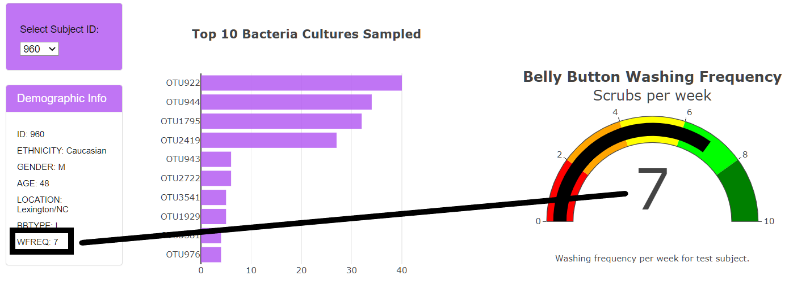

# Belly Button Biodiversity Dasbhoard

## Overview
To develop a web-based dashboard that pulls belly button bacteria results for test subjects, and presents the data using visual graphs and charts for deeper analysis.
There are four deliverables for this project:
- Create a horizontal bar chart
- Create a bubble chhart
- Create a guage chart
- Customize the dashboard

## Results
Code is written to create an array when a sample is selected from the dropdown menu, a bar, bubble and guage chart are also coded.

Here is the link to the code: <a href = "charts.js">Charts code</a>

When selected, the guage shows the selected subject's wash frequency, and the bar chart and bubble chart bacteria sample results.

Finally, the dashboard contains the following customizations:
- Added an image to the header and customized the header text.
- Customized the panel-heading and panel-title to use a background color that pulls color from the header image.
- Added text captions to the horizontal bar chart and guage charts to describe the chart with additional details.
- Customized the horizontal bars to use the same color as the panel-heading and title background colors.
- Used a specialized colorscale for the bubble chart.

## Link to final dashboard
The working dashboard is available through Github pages here:

<a href="https://teresawehmeier.github.io/plotlyDeploy/">Belly Button Biodivesity</a>
